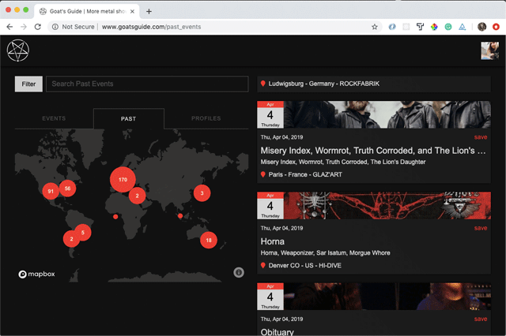
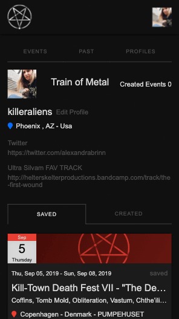
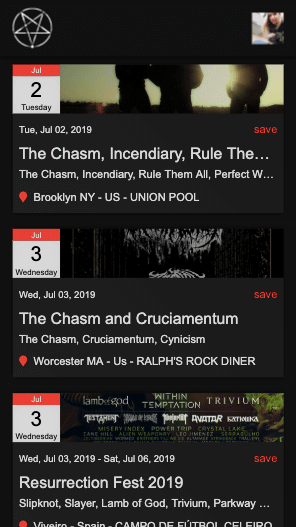
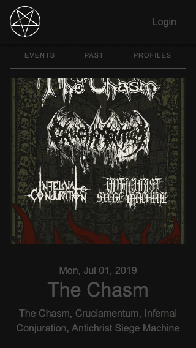
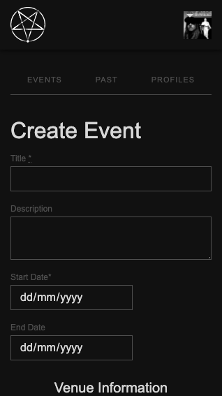

# Goat's Guide

**Event listings for upcoming concerts with a map. [goats-guide.herokuapp.com (MVP) ](http://goats-guide.herokuapp.com/)**

This site is for fans of metal. You can create an account [here](http://goats-guide.herokuapp.com/users/sign_up) if you wish to add events to the database.

MVP built using Ruby on Rails, HTML-scraping using gems such as Watir and Nokogiri coupled with custom scripts to aggregate data.

## Usage and Screenshots.

**[View upcoming or past events](http://goats-guide.herokuapp.com/) to post and upcoming event.**

  <kbd>
      
  </kbd>

 

**[Create a profile](http://goats-guide.herokuapp.com/users/sign_in).**

  <kbd>
      
  </kbd>

 

**Save events.**

  <kbd>
      
  </kbd>

 

**View event details.**

  <kbd>
      
  </kbd>

 

**Create an event.**

  <kbd>
      
  </kbd>

 

## Technologies

- Ruby on Rails
- Sidekiq background tasks
- Watir
- Nokogiri
- Devise authentication

